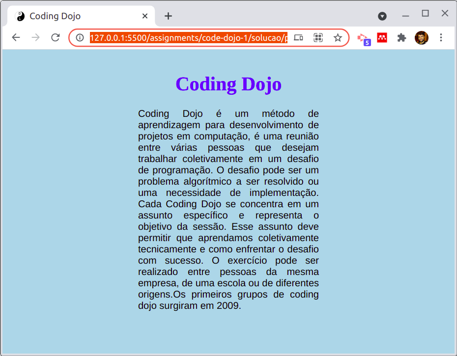

<!-- {"layout": "centered"} -->
# Coding Dojo

---
# O que é Coding Dojo? <!-- {.push-left style="height: 100px;"} -->

- **Dojo**: local de treinamento :japanese_castle: (em japonês)
  - Termo usado em artes marciais

- **Coding Dojo**: Local de treinamento para **codificar**
---
# Coding Dojo <!-- {.push-left style="height: 100px;"} -->
Codificação **em grupo**, em que o aluno pode desempenhar um dos três papeis:

**Piloto**:
  ~ Aluno que está programando

**Copiloto**:
  ~ Auxilia a programação ao lado do piloto
  ~ Pode ser chamada para ser **piloto**

**Platéia**:
  ~ Observa o código, auxilia quando necessário
  ~ Pode ser chamada para ser **piloto** ou **copiloto**

---
## Regras do Coding Dojo

- O valor da prática será perdido por:
  - Indisciplina e desrespeito
  - Aluno atrasado
  - Recusar a participação como piloto/copiloto
    - Ou não querer sair do computador, quando solicitado
    - Ou, ainda, tentar assumir a posição de piloto quando não é a sua vez
  - Fazer algo não relacionado ao exercício
  - Parar de participar por:
    - Usar outro computador
    - Uso de celular
    - Usar a internet
    - Conversa

---
<!-- {"layout": "centered-horizontal"} -->
# Coding Dojo

Exercício: fazer uma página explicando o que é Coding Dojo

---
## Criação da Página

- Crie uma **pasta** na área de trabalho
- **Crie um arquivo HTML**
- No início do HTML, **especifique a versão do HTML**: `<!DOCTYPE html>`
- Escreva as **tags principais no arquivo** (html, head  e body)
- **Exiba o título** (na aba do navegador) `Coding Dojo`

---
## Criação da Página

- **Utilize a propriedade charset** da tag `meta` (dentro do `head`) para garantir que o html seja lido da forma correta:
`<meta charset="utf-8">`
- Exiba um **ícone** para a página
 <!-- {.push-right style="height: 200px;"} -->
  - Ícone pode ser encontrado no arquivo `imgs-coding-dojo.zip`, disponibilizado no Moodle
  - Salve todas as imagens em uma pasta separada
- Para **testar**, escreva e exiba a frase `Coding dojo é muito legal`

---
## Título (primeiro nível) e estilos da página

-  <!-- {.push-right style="height: 240px;"} -->
  Título (primeiro nível):
	- Cor da fonte: Azul (`blue`)
	- Centralizado
- Fundo da página: Azul claro (`lightblue`)
- Margem (esquerda e direita): 30%
- Abrir a página `Coding Dojo` da Wikipédia
  - Crie um parágrafo utilizando o texto da Wikipedia de "Coding dojo é..." até "a partir do trabalho dos pilotos anteriores."
- Parágrafo: Justificado, com fonte Arial ou sans-serif

---
## Título (segundo nível) e estilos da página

- Título (segundo nível):
	- Cor da fonte: Azul (`blue`)
	- Texto alinhado à esquerda
   <!-- {.push-right style="height: 280px;"} -->
- Página `Coding Dojo` da Wikipedia:
  - Primeiro parágrafo: use o texto da Wikipédia de "O mestre oferece..." até "entre si e o piloto e copiloto."
  - Segundo parágrafo: use o texto da Wikipédia de "Independente do desafio..." até "ligeiramente mais complexo."

---
## Alteração no primeiro parágrafo

- **Apenas o primeiro parágrafo** deve ser:
   <!-- {.push-right style="height: 300px;"} -->
  - Cor de fundo: Azure
  - Borda: pontilhada, 1 pixel e preto
  - Espaçamento entre o texto e a borda: 3px
    - Espaçamento possível usando a propriedade `padding`

---
## Outras alterações no texto...

  - Deixar a primeira aparição da palavra **Coding Dojo** com uma grafia mais forte
   <!-- {.push-right style="height: 300px;"} -->
	- Marcar a definição de **Coding Dojo** no texto
	- Deixar enfatizado os textos: "método de aprendizagem" e "hackerspaces"
  - Escrever e riscar a palavra "yoda", como na imagem

---
## Inserção da Imagem

-  <!-- {.push-right style="height: 300px;"} -->
  Insira a imagem `coding-dojo.png` após o primeiro título
- Insira a imagem `evento-code-dojo.jpg` após o segundo título
- Centralize as imagens

---
## Links Externos e na Própria Página

- Insira um link, no final da página, para voltar ao topo da página
 <!-- {.push-right style="height: 400px;"} -->
- Insira um link para a página da Wikipédia sobre Coding Dojo:
  `https://pt.wikipedia.org/wiki/Coding_Dojo`

---
## Uma Nova Página

- Crie uma pasta chamada `outrasPaginas` e, dentro dela, um arquivo HTML
  chamado `links.html`
 <!-- {.push-right style="height: 125px;"} -->
- No início do HTML, especifique a versão: `<!DOCTYPE html>`
- Crie as _tags_ principais desta página
- Utilize o atributo `charset` da _tag_ `meta` (dentro do `head`) para
  garantir que o html seja lido da forma correta: `<meta charset="utf-8">`
- Crie um título para a página
- Exiba o ícone para a página (mesmo da página anterior)
- Conforme na imagem ao lado, a página deverá possuir uma borda dupla azul e margem de topo (margin-top) de 5% e margem nas laterais de 30%.

---
## Adicione texto, título e link à nova página

- Deixe um espançamento entre a borda e o texto de 10 pixels (use a propriedade `padding`)
- Crie uma lista não numerada de itens
 <!-- {.push-right style="height: 300px;"} -->
- Cada item é um link:
  - `http://www.devmedia.com.br/o-que-e-o-coding-dojo/30517`
  - `http://flaviosilveira.com/2011/coding-dojo-o-que-e-e-como-participar/`
  - `http://dojopuzzles.com/`

----
## Estilo

- Título: cor azul (_blue_) centralizado
 <!-- {.push-right style="height: 300px;"} -->
- Parágrafo: fonte "Arial", Justificado

---
## Link Voltar

- Crie o link para voltar para a página anterior
   <!-- {.push-right style="height: 400px;"} -->

---
## Retornando à pagina inicial...

- Faça um link para a página `links.html`
   <!-- {.push-right style="height: 400px;"} -->
