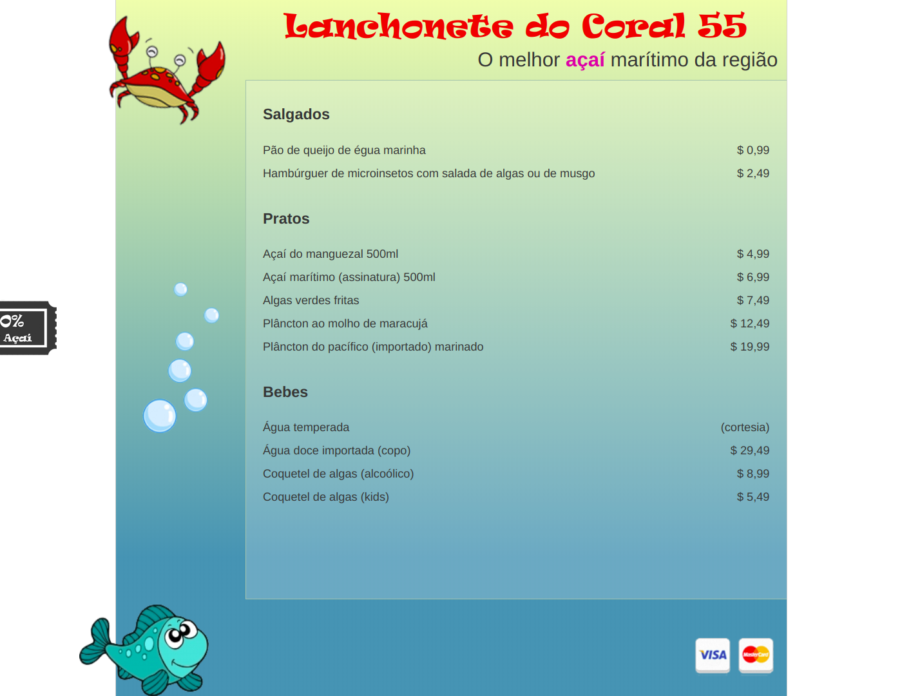
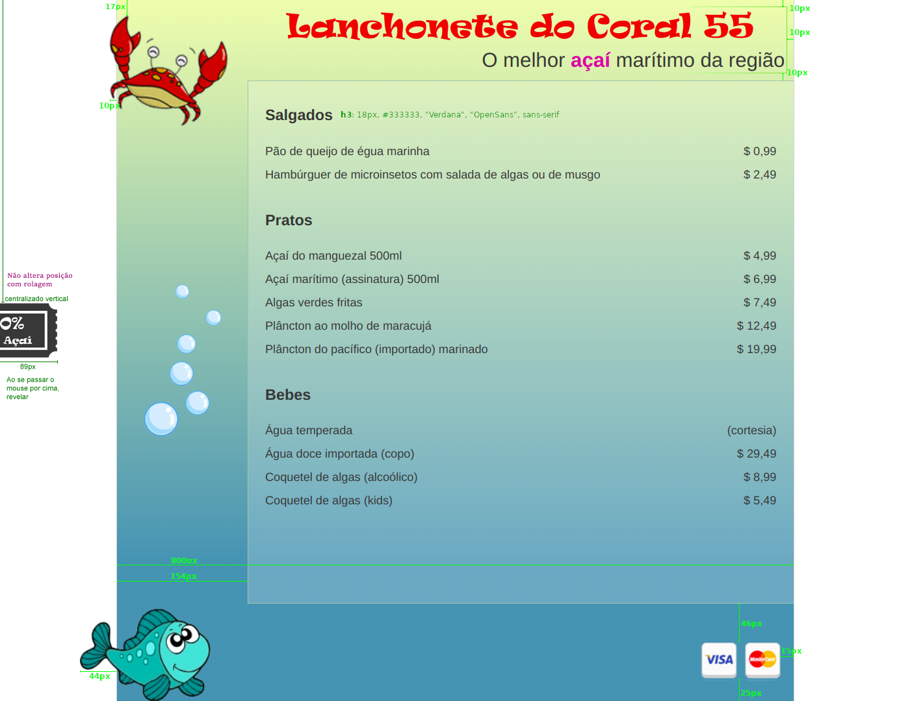
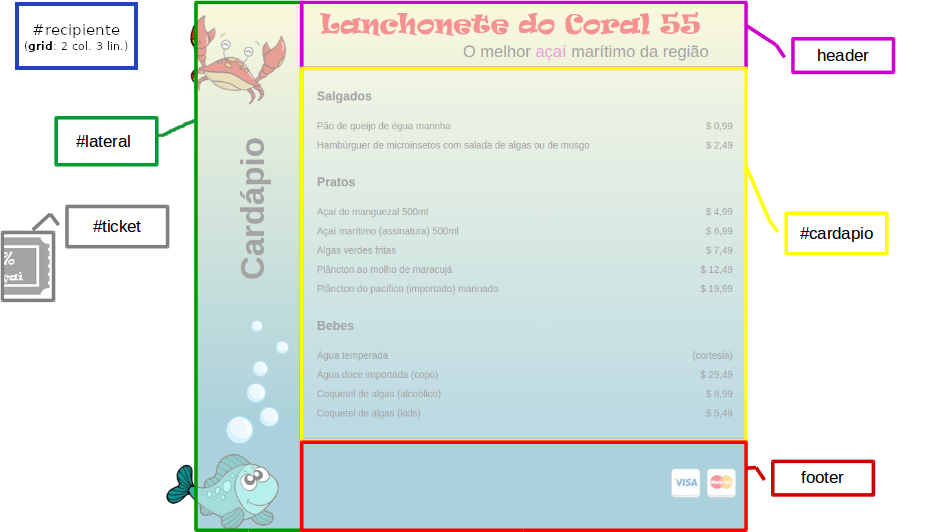
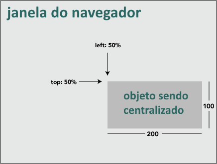
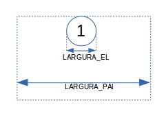

<!-- {"layout": "title"} -->
# **CSS** parte 5
## Especificidade de seletores, Centralizando coisas e a Lanchonete do Coral 55 :palm_tree:

---
# Na última aula (1/4)

| `position` | Descrição | Exemplos de uso | `top`, `right`, `bottom`, `left` | `z-index` |
|------------|-------------------------------------------------------------------|--------------------------------------------------------------------------------------------------------------|---------------------------------------|-----------------|
| `static` | Fluxo normal | Elementos **sem posicionamento especial** | ignorados | ignorado |
| `relative` | Fluxo normal, deslocado | Elementos que podem se **deslocar um pouco**; **contextos para elementos absolutos** | **deslocamentos** nas 4 direções | define ordem |

---
# Na última aula  (2/4)

| `position` | Descrição | Exemplos de uso | `top`, `right`, `bottom`, `left` | `z-index` |
|------------|-------------------------------------------------------------------|--------------------------------------------------------------------------------------------------------------|---------------------------------------|-----------------|
| `absolute` | Removido do fluxo, posicionado (x,y) relativo a um contexto | Elementos que queremos **definir os valores (x,y)** para posicioná-los exatamente nesse lugar | **posições** referentes às 4 direções | define ordem |
| `fixed` | Removido do fluxo, em um (x,y) na janela | Idem, mas a **posição é fixa na janela** | **posições** para as 4 direções | define ordem |

---
# Na última aula (3/4)

- Propriedades do **Flexbox**: <!-- {ul^0:.full-width.no-margin} -->
  - No elemento pai:  <!-- {ul^0:.layout-split-2} -->
    - `display: flex` <!-- {li^1:style="flex: 1"} -->
    - `flex-direction: row | column`
    - `justify-content: flex-start | flex-end | center | space-around | space-between`
  - Nos elementos filhos: <!-- {li^0:style="flex: 1"} -->
    - `align-self: flex-start | flex-end | center`
    - `order: numero`

<iframe width="100%" height="300" src="//jsfiddle.net/fegemo/f5odrgk9/embedded/result,html,css/" allowfullscreen="allowfullscreen" allowpaymentrequest frameborder="0"></iframe>

---
# Na última aula (4/4)

- Propriedades do **grid**: <!-- {ul^0:.full-width.no-margin} -->
  - No elemento pai: <!-- {ul^0:.layout-split-2} -->
    - `display: grid` <!-- {li^1:style="flex: 1"} -->
    - `grid-template-rows`
    - `grid-template-columns`
  - Nos elementos filhos: <!-- {li^0:style="flex: 1"} -->
    - `grid-row: inicio / fim`
    - `grid-column: inicio / fim`

<iframe width="100%" height="300" src="//jsfiddle.net/fegemo/sqtdb95x/embedded/result,html,css/" allowfullscreen="allowfullscreen" allowpaymentrequest frameborder="0"></iframe>

---
<!-- {"layout": "centered"} -->
# Roteiro de hoje

1. [Lanchonete do Coral 55](#lanchonete-do-coral-55) :palm_tree:
1. [Especificidade de seletores](#especificidade-de-seletores)
1. [Centralizando coisas](#centralizando-as-coisas)

---
<!--
{
  "embeddedStyles": ".ravie { font-family: Ravie, serif; color: #e90c0c; }",
  "layout": "section-header",
  "hash": "lanchonete-do-coral-55"
}
-->
# Lanchonete do Coral 55  <!-- {.ravie style="font-size: 2em"} -->
## Conhecendo o menu da lanchonete

- Atividade de hoje
- Layout e posicionamento
- Propriedade `line-height`

<!-- {ul:.content} -->

---
<!-- {"backdrop": "coral-55"} -->

---
## Comp / Specs

[](../../images/coral55-comp.png) <!-- {style="width: 49%"} -->
[](../../images/coral55-specs.png) <!-- {style="width: 49%"} -->

*[Comp]: Comprehensive Layout*
*[Specs]: Specifications*

---
# Atividade de hoje

1. O objetivo é treinar **_layout_ e posicionamento** em `CSS`
   - Usando Grid (`display: grid`) e Flexbox (`display: flex`)
   - O HTML está pronto, faltando o CSS da página
1. O _layout_ que usamos no exercício dos Unicórnios se chama **fluido** (100% da largura). Hoje,
   você vai fazer um **_layout_ de largura fixa**
   - O conteúdo da página deve ter `800px` de largura e deve estar centralizado
1. [Baixe os arquivos][coral-55-seminal]. Instruções detalhadas estão no
   arquivo README.md.

[coral-55-seminal]: https://github.com/fegemo/cefet-front-end-coral-55/archive/master.zip

---
## _Layout_ de páginas

- Para definir o **_layout_** (posição das regiões da página), uma boa ideia
  é usar **Grid** (`display: grid`)
- Para definir o posicionamento dos **elementos que formam cada região**,
  podemos usar **Flexbox** (`display: flex`) ou Grid (`display: grid`) também
- Se precisarmos definir exatamente o (x,y) de um elemento, ou de
  colocar um elemento em cima de outro, podemos usar `position`

Observação: **antigamente** era comum usar `float` em alguns elementos para
definirmos sua posição (como fizemos nos Unicórnios). Mas hoje em dia
preferimos usar o Flexbox e o Grid, que foram criados para isso.
<!-- {p:.note} -->

Veja como está estruturado o HTML e como você pode estilizar as partes

---
<!-- {
  "embeddedStyles": ".code pre { margin-left: 153px; } .code::before { content: 'H T M L'; display: inline-block; height: 4em; width: 1em; font-family: monospace; font-size: 110px; float: right; margin-left: 20px;}"
} -->

<div class="code">

```html
<body>
  <div id="recipiente">
    <header id="cabecalho-pagina">
      <!-- titulos -->
    </header>
    <section id="lateral">
      <!-- siri, peixe, bolhas -->
    </section>
    <main id="cardapio">
      <article><!-- ... --></article>
      <article><!-- ... --></article>
      <!-- mais itens do menu -->
    </main>
    <footer><!-- cartoes --></footer>
  </div>
  <aside id="ticket"><!-- ... --></aside>
</body>
```

</div>

---
<!-- {"state":"show-active-slide-and-previous", "containerStyles": {"--show-2-slides-x-distance": "300px", "--show-2-slides-z-distance": "-400px", "--show-2-slides-rotation": "10deg "}} -->

::: figure .figure-slides
 <!-- {.bullet.figure-step.bullet-no-anim} -->
 <!-- {.bullet.figure-step.bullet-no-anim} -->
:::

---
<!-- {"hash": "line-height"} -->
## A propriedade **line-height** ([na MDN](https://developer.mozilla.org/en-US/docs/Web/CSS/line-height))

- Define a altura de uma linha de texto.
- Inicialmente, `line-height: 1em;`, mas qualquer valor de medida de tamanho
  pode ser usado
  - Exemplo:
    ```css
    .espacamento-simples { line-height: 1em; }
    .espacamento-duplo   { line-height: 2em; }
    ```

    <p style="float: left; width: 45%; line-height: 1em; height: 100px; overflow: auto; border: 3px solid black">
      Lorem ipsum dolor sit amet, consectetur
    adipiscing elit. Curabitur mauris eros, fermentum eget dolor sit amet.</p>

    <p style="float: right; width: 45%; line-height: 2em; height: 100px; overflow: auto; border: 3px solid black">
    Lorem ipsum dolor sit amet, consectetur
    adipiscing elit. Curabitur mauris eros, fermentum eget dolor sit amet.</p>


---
<!-- {"layout": "section-header", "hash": "especificidade-de-seletores"} -->
# Especificidade de seletores
## Aplicando regras

- Mais de uma regra definindo a mesma propriedade
- Regras de especificidade
- Especificator Tabajara(tm)
<!-- {ul:.content} -->

---
## Motivação

- Dadas <u>mais de uma regra CSS definindo a mesma propriedade</u> para
  um elemento, qual prevalece?
  - Como determinar qual a cor do elemento?
    ```html
    <style>
      h4 { color: black; }
      h4 { color: white; }      
    </style>

    <h4>Arthur Dent</h4> <!-- qual a cor de Arthur Dent? -->
    ```

---
## Mais Difícil...

```html
<style>
  .destaque { color: red; }
  #titulo   { color: green; }
  h4        { color: blue; }
</style>

<h4 id="titulo" class="destaque">Ford Prefect</h4>
```
- E agora??
- Os **3 seletores <u>se aplicam</u>** ao elemento! <!-- {ul:.bulleted} -->
  - Mas com **prioridades diferentes**
  - (↑) mais específico o seletor da regra → (↑) maior sua prioridade
    - Neste caso, <h4 style="display: inline; color: green;">Ford Prefect (`green`)</h4>

---
## Regras gerais de especificidade

Regra 1 <!-- {dl:.bulleted} -->
  ~ Cada seletor tem uma **pontuação de especificidade**

Regra 2
  ~ Se dois seletores selecionam o mesmo elemento, mas com pontuações
    diferentes, ganha aquele com pontuação maior

Regra 3
  ~ Se dois seletores selecionam o mesmo elemento e têm a mesma
    pontuação, ganha o que foi declarado por último

Regra 4
  ~ Estilo Inline &gt;&gt; Arquivo Externo &gt;&gt; Incorporado

Regra 5
  ~ ID &gt;&gt; classe &gt;&gt; atributo &gt;&gt; tag

---
## Cálculo da **pontuação de especificidade**

- [Especificação na W3C sobre _CSS3 Selectors_](http://www.w3.org/TR/css3-selectors/#specificity)
- Algoritmo
  1. Contar o número de IDs no seletor (variável `a`)
  1. Contar o número de classes, atributos e pseudo-classes no seletor (`b`)
  1. Contar o número de tags e pseudo-elementos no seletor (`c`)
  1. Concatenar os três números (`abc`)

```css
#posts-recentes .post.novidade > h2 {
  /* id: 1, classes: 2, tag: 1 */
  /* pontuação: 121 */
}
```

---
## Exemplos

```css
/* seletor { propriedades }  abc */
li { }                    /* 001 */
.destaque { }             /* 010 */
li.destaque { }           /* 011 */

#rodape { }               /* 100 */
#rodape #logo { }         /* 200 */

a[href^="www"] { }        /* 011 */
p strong em { }           /* 003 */
```

---
## Exercício

- Qual é a cor do texto?
  ```html
  <style>
    #a .b .c { color: red; }
    .d .e .f { color: green; }
    .g .h #i { color: blue; }
  </style>
  <p id="a" class="d g">
      <strong class="b e h">
          <em id="i" class="c f">Qual é a minha cor?</em>
      </strong>
  </p>
  ```
  - [Resposta](https://jsfiddle.net/fegemo/bw1xt1az/) no JSFiddle

---
<!--
{
  "layout": "centered-horizontal",
  "hash": "specificator-tabajara",
  "scripts": ["../../scripts/classes/spec-tabajara.min.js"],
  "styles": ["../../styles/classes/spec-tabajara.min.css"]
}
-->

## **CoutoSan™** Specificity  <!-- {.emoji.portrait.bordered style="margin-left: 0.5em"} --> <!-- {.emoji.portrait.bordered} -->

<article id="spec-tabajara">
  <div>
    <input type="text" id="spec-tabajara-input" placeholder="Digite um seletor aqui...">
  </div>
  <div>
    <button id="spec-tabajara-button">Calcular</button>
  </div>
  <div>
    <div class="spec-class">
      <div id="spec-tabajara-output-a" class="spec-output">0</div>
      <div>(a) IDs</div>
    </div>
    <div class="spec-class">
      <div id="spec-tabajara-output-b" class="spec-output">0</div>
      <div>(b) Classes, atributos e pseudo-classes</div>
    </div>
    <div class="spec-class">
      <div id="spec-tabajara-output-c" class="spec-output">0</div>
      <div>(c) Elementos, pseudo-elementos</div>
    </div>
  </div>
</article>

---
<!-- {"layout": "section-header", "hash": "centralizando-as-coisas"} -->
# Centralizando as coisas
## Centralizando elementos em diferentes cenários

- Centralizando horizontalmente
- Centralizando verticalmente
<!-- {ul:.content} -->

---
<!-- {"hash": "centralizacao-horizontal"} -->
# Centralizando **horizontalmente** <!-- {.underline.upon-activation} -->

- Existem várias formas para centralizar elementos que se aplicam a **situações diferentes**:
  1. Centralizar o conteúdo _inline_ de um elemento
  1. Centralizar um elemento `block` ou `inline-block` com largura definida
  1. Centralizar um elemento com `position: absolute` ou `fixed`...
     1. ...quando ele tem largura fixa
     1. ...quando ele é fluido
  1. E outras formas...

---
## (1) Centralizando conteúdo _inline_

- Para **centralizar os filhos `inline`** de um elemento:
  ```css
  .centraliza-os-filhos {
    text-align: center;   /* usar a propriedade text-align: center */
  }
  ```
  - Exemplos:
    - centralizar texto (que é _inline_) dentro de um título h1
    - centralizar uma imagem (_inline_) dentro de um parágrafo
    - centralizar `<span>` (_inline_ ou `inline-block`) dentro de uma `<div>`:
      <iframe width="100%" height="100" src="//jsfiddle.net/fegemo/hko474g8/embedded/result,html,css/" allowfullscreen="allowfullscreen" frameborder="0"></iframe>

---
## (2) Centralizando um elemento _block_

- Para **centralizar um elemento `block`**:
  ```css
  .centraliza-block {
    margin: 0 auto; /* margin-left: auto, margin-right: auto, top/bottom: 0 */
  }
  ```
  - Exemplos:
    - centralizar uma imagem com `display: block`
    - centralizar uma `<div>` dentro de outra
    - centralizar uma `<table>` dentro de seu container:
      <iframe width="100%" height="130" src="//jsfiddle.net/fegemo/3a21w96j/embedded/result,html,css/" allowfullscreen="allowfullscreen" frameborder="0"></iframe>

---
<!-- {"layout": "2-column-content"} -->
## (3.0) Centralizando um elemento `absolute` ❌

- Ideia: <!-- {ul:.bullet} -->
  ```css
  .centraliza-tentativa {
    position: absolute; /* ou fixed */
    left: 50%;
  }
  ```
  - Não funciona porque o objeto começa em 50% do pai

 <!-- {.bullet} -->

Há duas soluções: (a) se o tamanho do pai for definido (ex, valor em px) e (b) se o pai for fluido (ex, largura em %) <!-- {p.note.info.span-columns.bullet} -->

---
## (3.1) Centralizando um elemento `absolute`

- Centralizando um elemento com `position: absolute` ou `fixed` quando a
  **largura do seu pai é conhecida**:
  ```css
  .centraliza-elemento-absoluto {
    position: absolute; /* ou fixed */
    left: calc((LARGURA_PAI - LARGURA_EL) / 2);
  }
  ```
   <!-- {.push-right} -->

  - Onde `LARGURA_PAI` é a largura do pai (recipiente) e `LARGURA_EL` é a largura
    do elemento que queremos centralizar
  - Veja [como funciona esse `calc(...)`][calc] do CSS

[calc]: https://css-tricks.com/a-complete-guide-to-calc-in-css/

---
## (3.2) Centralizando um elemento `absolute`

- Centralizando um elemento com `position: absolute` ou `fixed` 
  **em um recipiente fluido** (largura do pai pode variar):
  ```css
  .centraliza-elemento-com-pai-fluido {
    position: absolute;          /* ou fixed */
    left: 50%;                   /* põe no "meio", só que começando dele */
    transform: translateX(-50%); /* volta metade da largura do elemento */
  }
  ```
  - Em outra aula aprenderemos a propriedade CSS `transform`
- Mais: [Um guia sobre como centralizar qualquer elemento](https://css-tricks.com/quick-css-trick-how-to-center-an-object-exactly-in-the-center/)

---
# Centralizando **verticalmente**  <!-- {.underline.upon-activation.alternate-color} -->

- Assim como a centralização horizontal, a vertical depende do cenário:
  1. Centralizar um elemento com `position: static`
  1. Centralizar um elemento com `position: absolute` ou `fixed`

---
<!-- {"layout": "2-column-content", "hash": "centralizando-verticalmente-static", "slideStyles": {"grid-template-rows": "auto auto auto"}} -->
## (1) Centralizando vertic. um elemento `static`

- Podemos usar **flexbox** com `display: flex` no pai e `align-self: center` no filho sendo centralizado <!-- {ul:.span-columns} -->

```css
.recipiente {
  display: flex;
  /*justify-items: center; 
   ⬆️ se quiser horizontal tbm */
}
.centralizando-vertical {
  align-self: center;
}
```

::: result .center-flex-example 
<style>
.center-flex-example p::before {
  content: '<p class="recipiente">';
  display: block;
  position: absolute;
  right: 1em;
  top: 0;
  font-style: italic;
  color: darkgoldenrod;
  font-size: 0.45em;
}
</style>
<span style="align-self: center; background: #ddd; padding: .25em">UM SPAN</span> <!-- {p:style="display: flex; height: 5em;border: 1px dotted darkgoldenrod;"} -->
:::

---
<!-- {"classes": "compact-code", "hash": "centralizando-verticalmente-absolute-fixed"} -->
## (2) Centralizando vertic. um elemento `absolute`

- É feito de forma análoga à centralização horizontal de um elemento com
  `position: absolute` ou `fixed`:
  1. Container com altura conhecida:
     ```css
     .centraliza-elemento-absoluto {
       position: absolute;
       top: calc((ALTURA_PAI - ALTURA_EL) / 2);
     }
     ```
  1. Container fluido: <!-- {li:.two-column-code} -->
     ```css
     .centraliza-elemento-absoluto {
       position: absolute;
       top: 50%;
       transform: translateY(-50%);
     }

     .centraliza-elemento-absoluto {
       position: absolute;
       top: 50%;
       left: 50%; /* horizontal tbm */
       transform: translate(-50%, -50%);
     }
     ```

---
<!-- {"layout": "centered"} -->
# Referências

- [Propriedade **position** na MDN](https://developer.mozilla.org/en-US/docs/Web/CSS/position)
- [Um breve e interessante tutorial sobre posicionamento](http://learnlayout.com/position.html)
